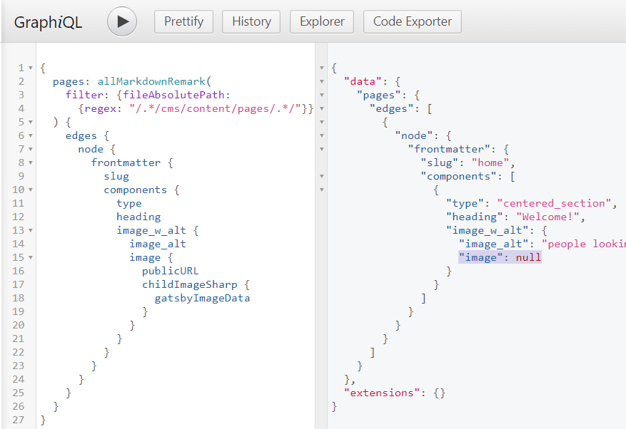

# Gatsby GraphQL Image Query Bug Repro

The Gatsby graph fails to query images in certain situations in a Netlify CMS project.

#### Repro Steps:

- Install and run (`yarn; yarn develop`)
- Typically when running clean, frontend dev & build work correctly but you will still see
  the image get `null` in [GraphiQL (full query)](<http://localhost:8000/___graphql?query=%7B%0A%20%20pages%3A%20allMarkdownRemark(%0A%20%20%20%20filter%3A%20%7B%0A%20%20%20%20%20%20fileAbsolutePath%3A%20%7B%0A%20%20%20%20%20%20regex%3A%20%22%2F.*%2Fcms%2Fcontent%2Fpages%2Fhome.md%2F%22%0A%20%20%20%20%7D%0A%20%20%7D)%20%7B%0A%20%20%20%20edges%20%7B%0A%20%20%20%20%20%20node%20%7B%0A%20%20%20%20%20%20%20%20frontmatter%20%7B%0A%20%20%20%20%20%20%20%20%20%20slug%0A%20%20%20%20%20%20%20%20%20%20heading%0A%20%20%20%20%20%20%20%20%20%20image%20%7B%0A%20%20%20%20%20%20%20%20%20%20%20%20childImageSharp%20%7B%0A%20%20%20%20%20%20%20%20%20%20%20%20%20%20gatsbyImageData%0A%20%20%20%20%20%20%20%20%20%20%20%20%7D%0A%20%20%20%20%20%20%20%20%20%20%7D%0A%20%20%20%20%20%20%20%20%20%20alt%0A%20%20%20%20%20%20%20%20%7D%0A%20%20%20%20%20%20%7D%0A%20%20%20%20%7D%0A%20%20%7D%0A%7D>)
  the GraphiQL query will start succeeding.
- Stop the dev server: now that there's a Gatsby cache, `develop` AND `build` get a null image.
- Changing any text in [home.md](src/cms/content/pages/home.md) will bust the cache and make the image query work in dev.
- Running `yarn clean` will reset the build so it succeeds again.

Netlify builds exhibit this same behavior: they work on fresh build but fail on cached builds.

The same setup worked fine on Gatsby 3, the bug is specific to Gatsby 4. This project uses the `gatsby-transformer-remark`
plugin, plus the community plugin `gatsby-remark-relative-images`, which might potentially be causing this caching problem.

